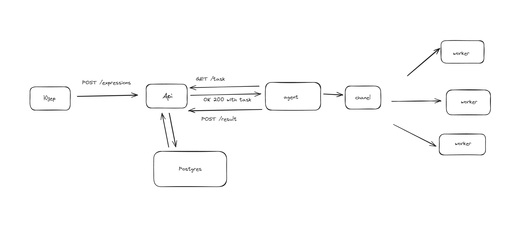

# Yalms
Простой сервер с оркестратором и агентами, могут решать простые арифметические задачи со скобками



## Требования
docker и docker compose - если вы на linux
```bash
apt install docker docker-compose
```
или запущенный [docker desktop](https://www.docker.com/products/docker-desktop/)

так же потребуется [insomnia](https://insomnia.rest/download) для отправки запросов, она бесплатна и конфиг с роутами прикреплён к гиту

## Как запустить?
Зайдите в dotenv и измените параметры.

После этого в главной папке проекта запустите compose
```bash
docker compose up -d
```

## Как использовать?

### Если вы не зарегистрированы

1. Зайдите в insomnia
2. Нажмите use local scratch pad внизу логина
3. Найдите слева сверху плашку c названием scratch pad
4. import -> выбираем файл insomia.json -> scan -> import
5. Выбираем любой роут и делаем реквесты через send
6. если нужна информация выбирам в роуте вкладку docs
7. данные для отправки реквеста меняем во вкладке json

### Если вы зарегистрированы

1. Зайдите в insomnia
2. Входите в аккаунт
3. Найдите слева снизу плашку c названием documents
4. по центру выбираем import -> выбираем файл insomia.json -> scan -> import
5. Выбираем любой роут и делаем реквесты через send
6. если нужна информация выбирам в роуте вкладку docs
7. данные для отправки реквеста меняем во вкладке json